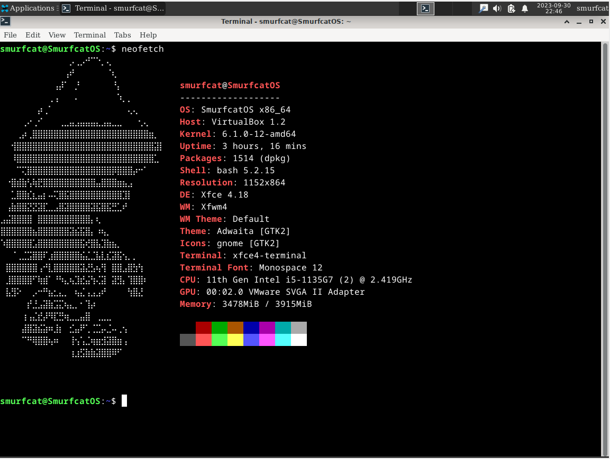
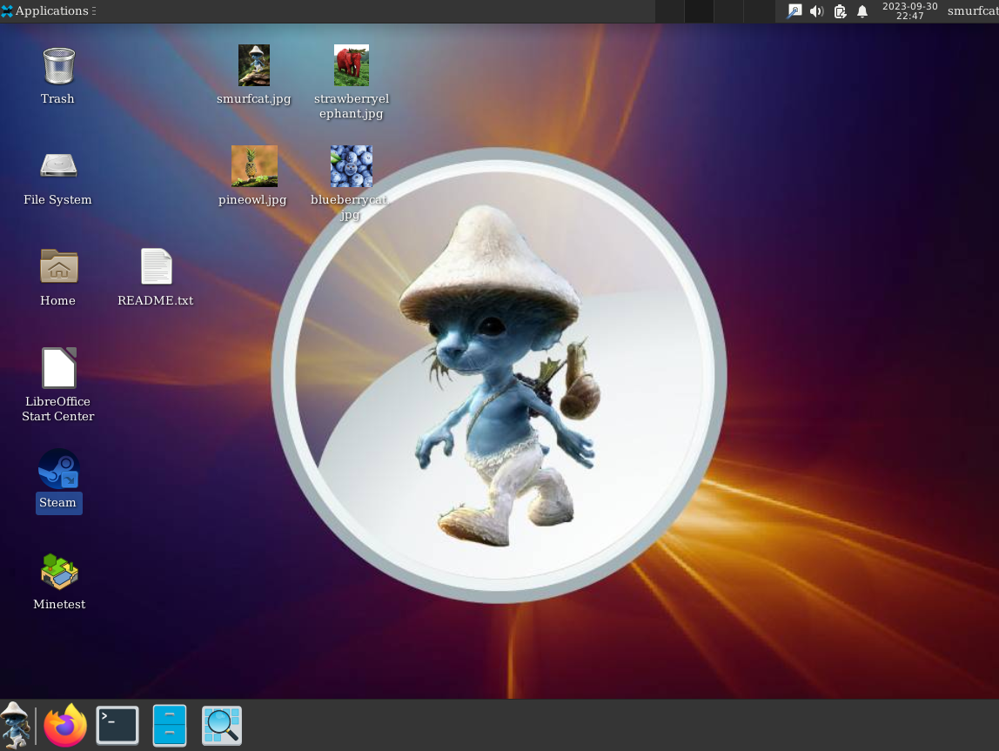

# 

SmurfcatOS is the operating system dedicated to the world renowned Smurf Cat, or Shailushai (Шайлушай). The simple blue cat, paired with "The Spectre" by Alan Walker, has taken the whole world by storm. 

It is a 64-bit riced version of Debian 12 (Bookworm).

## Features
- Custom wallpapers
- Custom Neofetch
- LibreOffice pre-installed
- Steam pre-installed (for all you epic gamers out there)
- Minetest pre-installed (open-source Minecraft clone for you even epic-er gamers)
- Firefox with custom startpage

## Contact
Here is our Discord server for support [https://discord.gg/F7yxRzhSMZ](https://discord.gg/F7yxRzhSMZ)

## Our Thanks To
- Smurf cat
- Alan Walker
- [AmogOS](https://github.com/Amog-OS/AmogOS) for inspiration

And always remember: *We live, we love, we lie.*
